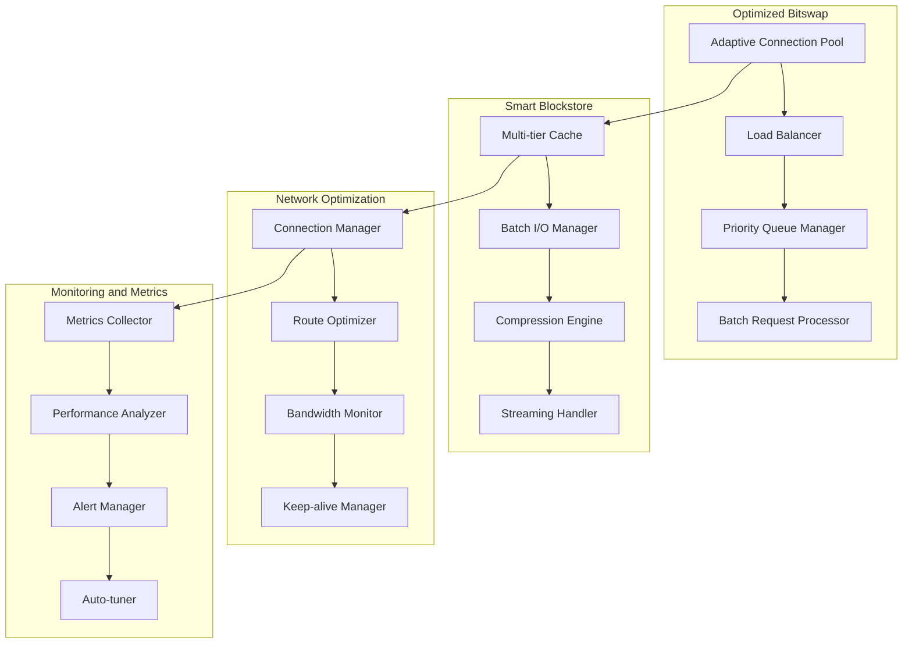

# Boxo High Load Optimization Design

## Overview

This document describes architectural solutions for optimizing the Boxo library for high load operation as part of an IPFS-cluster. The project aims to improve performance of key components: Bitswap, blockstore, network layer, and monitoring system.

## Architecture

### Current State

Code analysis reveals the following current limitations:
- `BitswapMaxOutstandingBytesPerPeer = 1 << 20` (1MB) - may be insufficient for high load
- `BitswapEngineBlockstoreWorkerCount = 128` - fixed number of workers
- `DefaultReproviderInterval = 22 hours` - may be too long for dynamic clusters
- Lack of adaptive resource management

### Target Architecture



## Components and Interfaces

### 1. Adaptive Bitswap Engine

#### AdaptiveBitswapConfig Interface
```go
type AdaptiveBitswapConfig struct {
    // Dynamic limits
    MaxOutstandingBytesPerPeer int64  // Adaptive limit 1MB-100MB
    MinOutstandingBytesPerPeer int64  // Minimum limit 256KB
    
    // Worker pools
    MinWorkerCount int // Minimum 128
    MaxWorkerCount int // Maximum 2048
    
    // Prioritization
    HighPriorityThreshold time.Duration // 50ms
    CriticalPriorityThreshold time.Duration // 10ms
    
    // Batching
    BatchSize int // 100-1000 requests
    BatchTimeout time.Duration // 10ms
}
```

#### PriorityRequestManager Component
- Request classification by priority
- Dynamic resource allocation
- Circuit breaker for overload protection

### 2. Optimized Blockstore

#### MultiTierBlockstore Interface
```go
type MultiTierBlockstore interface {
    // Multi-tier caching
    GetWithTier(ctx context.Context, cid cid.Cid, tier CacheTier) (blocks.Block, error)
    PutBatch(ctx context.Context, blocks []blocks.Block) error
    
    // Streaming processing
    GetStream(ctx context.Context, cid cid.Cid) (io.ReadCloser, error)
    PutStream(ctx context.Context, cid cid.Cid, data io.Reader) error
}

type CacheTier int
const (
    MemoryTier CacheTier = iota
    SSDTier
    HDDTier
)
```

#### BatchIOManager Component
- I/O operation grouping
- Asynchronous writes with acknowledgment
- Data compression for space efficiency

### 3. Network Optimization

#### AdaptiveConnManager Interface
```go
type AdaptiveConnManager interface {
    // Adaptive connection pools
    SetDynamicLimits(high, low int, gracePeriod time.Duration)
    
    // Connection quality monitoring
    GetConnectionQuality(peer peer.ID) ConnectionQuality
    
    // Automatic route switching
    OptimizeRoutes(ctx context.Context) error
}

type ConnectionQuality struct {
    Latency time.Duration
    Bandwidth int64
    ErrorRate float64
    LastSeen time.Time
}
```

#### NetworkOptimizer Component
- Adaptive buffer size adjustment
- Detection and bypass of slow connections
- Keep-alive management

### 4. Monitoring System

#### PerformanceMonitor Interface
```go
type PerformanceMonitor interface {
    // Metrics collection
    CollectMetrics() *PerformanceMetrics
    
    // Performance analysis
    AnalyzeBottlenecks() []Bottleneck
    
    // Automatic tuning
    AutoTune(ctx context.Context) error
}

type PerformanceMetrics struct {
    BitswapMetrics    BitswapStats
    BlockstoreMetrics BlockstoreStats
    NetworkMetrics    NetworkStats
    ResourceMetrics   ResourceStats
}
```

## Data Models

### Performance Configuration
```go
type HighLoadConfig struct {
    // Bitswap settings
    Bitswap AdaptiveBitswapConfig
    
    // Blockstore
    Blockstore BlockstoreConfig
    
    // Network settings
    Network NetworkConfig
    
    // Monitoring
    Monitoring MonitoringConfig
}

type BlockstoreConfig struct {
    // Cache settings
    MemoryCacheSize int64 // 2GB default
    SSDCacheSize    int64 // 50GB default
    
    // Batching
    BatchSize    int           // 1000 blocks
    BatchTimeout time.Duration // 100ms
    
    // Compression
    CompressionEnabled bool
    CompressionLevel   int // 1-9
}

type NetworkConfig struct {
    // Connection manager
    HighWater    int           // 2000
    LowWater     int           // 1000
    GracePeriod  time.Duration // 30s
    
    // Connection quality
    LatencyThreshold    time.Duration // 200ms
    BandwidthThreshold  int64         // 1MB/s
    ErrorRateThreshold  float64       // 0.05 (5%)
    
    // Keep-alive
    KeepAliveInterval time.Duration // 30s
    KeepAliveTimeout  time.Duration // 10s
}
```

### Performance Metrics
```go
type BitswapStats struct {
    RequestsPerSecond     float64
    AverageResponseTime   time.Duration
    P95ResponseTime       time.Duration
    OutstandingRequests   int64
    ActiveConnections     int
    QueuedRequests        int64
}

type BlockstoreStats struct {
    CacheHitRate          float64
    AverageReadLatency    time.Duration
    AverageWriteLatency   time.Duration
    BatchOperationsPerSec float64
    CompressionRatio      float64
}

type NetworkStats struct {
    ActiveConnections     int
    ConnectionQuality     map[peer.ID]ConnectionQuality
    TotalBandwidth        int64
    AverageLatency        time.Duration
    PacketLossRate        float64
}
```

## Error Handling

### Fault Tolerance Strategies

1. **Circuit Breaker Pattern**
   - Automatic disconnection of problematic components
   - Gradual load recovery
   - Health status monitoring

2. **Graceful Degradation**
   - Service quality reduction under overload
   - Prioritization of critically important operations
   - Automatic resource scaling

3. **Retry Mechanisms**
   - Exponential backoff for retries
   - Jitter to avoid thundering herd
   - Maximum retry attempts

### Specific Error Handling

```go
type ErrorHandler interface {
    HandleBitswapError(err error, peer peer.ID) error
    HandleBlockstoreError(err error, cid cid.Cid) error
    HandleNetworkError(err error, conn network.Conn) error
}

// Error types
var (
    ErrHighLatency     = errors.New("connection latency too high")
    ErrBandwidthLimit  = errors.New("bandwidth limit exceeded")
    ErrMemoryPressure  = errors.New("memory pressure detected")
    ErrDiskSpaceLow    = errors.New("disk space running low")
)
```

## Testing Strategy

### 1. Load Testing
- Simulation of 10,000+ concurrent connections
- Peak load testing (100,000 requests/sec)
- Long-term stability tests (24+ hours)

### 2. Integration Testing
- Testing in cluster environment
- Component interaction verification
- Metrics and alerts validation

### 3. Fault Tolerance Testing
- Network failure simulation
- Recovery testing after failures
- Circuit breaker logic verification

### 4. Performance Benchmarks
```go
func BenchmarkBitswapHighLoad(b *testing.B) {
    // Bitswap performance test under load
}

func BenchmarkBlockstoreBatchOperations(b *testing.B) {
    // Blockstore batch operations test
}

func BenchmarkNetworkOptimization(b *testing.B) {
    // Network optimization test
}
```

### Performance Criteria
- Response time < 100ms for 95% of requests
- Throughput > 10,000 requests/sec
- Memory usage stable for 24+ hours
- CPU utilization < 80% at peak load
- Network latency < 50ms between cluster nodes